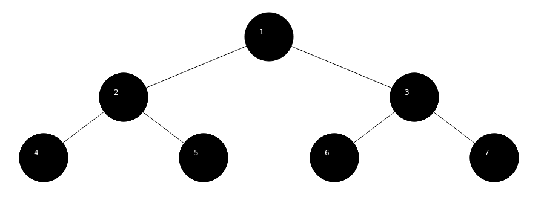

adi.peisach@gmail.com
# Tree Iterators GUI - Systems Programming Assignment 4

In this assignment, I built a Tree container of generic nodes with a predefined maximum degree, and
implemented iterators for different traversal methods. I also built a GUI for the tree, which
displays the tree and allows the user to traverse it using buttons.

## How to use

First, initialize the tree by using the constructor. You have to specify the maximum degree D of the
tree and the type of the data that the tree will contain T.

    Tree<T, D> tree;

Build the tree using the functions: ```addRoot(value)``` and ```addSubNode(parentValue, childValue)```.
For example:

    Tree<int, 2> tree;
    tree.addRoot(1);
    tree.addSubNode(1, 2);
    tree.addSubNode(1, 3);
    tree.addSubNode(2, 4);
    tree.addSubNode(2, 5);
    tree.addSubNode(3, 6);
    tree.addSubNode(3, 7);

Will create the following tree:



You can use the following iterators to traverse the tree:

- ```BFS```: Traverses the tree in breadth-first search order.
- ```DFS```: Traverses the tree in depth-first search order.
- ```PreOrder```: Traverses the tree in pre-order (if the tree isn't binary it will be DFS instead).
- ```InOrder```: Traverses the tree in in-order (if the tree isn't binary it will be DFS instead).
- ```PostOrder```: Traverses the tree in post-order (if the tree isn't binary it will be DFS instead).
- ```Heap```: Converts the tree to a heap and traverses it in heap order (only works with binary trees).

The default iterator is ```BFS```. Here's an example:

    for (auto& node : tree) {
        std::cout << *node << " ";
    }

Note that Node overloads the * operator to return the value of the node.

In order to display the ree using the GUI, use the function ```display(tree)```. The GUI will display the
tree and allow the user to traverse it using buttons.

## How to run

To run the project, you will first have to build the makefile using the following command:

    qmake project.pro

Then, you will be able to run Demo.cpp, which contains a demonstration of the tree and the GUI using:

    make

or

    make tree

In order to run the tests, use the following command:

    make test

You can also use the shell script ```run.sh``` to build and run the project:

    ./run.sh

Don't forget to give the script execution permissions:

    chmod +x run.sh

In order to run valgrind:

    valgrind --tool=memcheck $(VALGRIND_FLAGS) ./test 2>&1 | { egrep "lost| at " || true; }

### Complex

I've also added a Complex number class, which the tree supports as well. The Complex class supports
the operations: +, -, *, /, ==, !=, <= and >= and also has a ```toString()``` function.

## Libraries used

I've used the standard C++ libraries for standard containers and algorithms such as vector and queue, 
as well as the QT library for the GUI.

## Hierarchy

The project is divided into the following files:

- ```Demo.cpp```: Contains a demonstration of the tree and the GUI.
- ```Tree.cpp```: Contains the tree class and the iterators. It contains an abstract TreeIterator
class and an iterator class for each traversal method mentioned above that extends TreeIterator.
- ```Node.cpp```: Contains the Node class, which contains a value and a list of children.
- ```Complex.cpp```: Contains the complex number class.
- ```Screen.cpp```: Contains the GUI class that controls the displaying of the tree and the buttons.
- ```Constants.hpp```: Contains the constants used in the project.
- ```Test.cpp```: Contains the tests for the project.